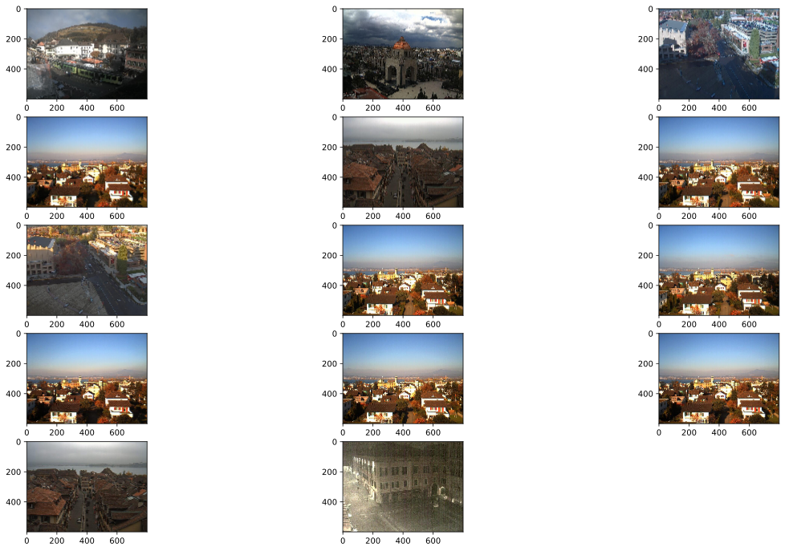

## Naive day-night classification exercise

I use some extractions from AMOS data as dataset. Classifier is based on **Saturation** and **Value** values of image, plain `if`-statement. Goal of this exercise is to get along with image classification pipeline, get more familiar with datasets and get hands-on experience on image processing tasks.

### Step 1. Importing important stuff


```python
import numpy as np
import matplotlib.pyplot as plt
import matplotlib.image as mpimg
import glob
import os
import cv2

IMAGE_SIZE = (800, 600)
```

### Step 2. Define some useful functions

Dataset loader function could be easily improved for splited on train/test folders structure if needed


```python
def load_dataset(im_dir):
    img_list = []
    img_type = ['day', 'night']

    for tp in img_type:
        for image_path in glob.glob(os.path.join(im_dir, tp, "*")):
            image = mpimg.imread(image_path)
            image = cv2.resize(image, IMAGE_SIZE)
            binary_type = 0 if tp == "night" else 1
            img_list.append((image, binary_type))

    return img_list
```

**average_channel** computes average value of all HSV values given image and channel id  


```python
def average_channel(image, channel=2):
    # brightness is default channel
    hsv = cv2.cvtColor(image, cv2.COLOR_RGB2HSV)
    brightness = hsv[:,:,channel]
    average = np.sum(brightness) / (IMAGE_SIZE[0]*IMAGE_SIZE[1])
    return average
```

Basic classifier, my hypothesis is if average brightness of image is greater than 100 and average saturation is less than 90, then with high probability this image is day image.


```python
def classify(image):
    brightness = average_channel(image, 2)
    saturation = average_channel(image, 1)
    # day if average brightness > 100
    if brightness > 100 and saturation < 90:
        return 1
    return 0
```

Little helper for computing accuracy of prediction in percents


```python
def accuracy(correct, total):
    return round(correct/total*100, 2)
```

### Step 3. Load dataset and run prediction routine


```python
ds = load_dataset("./day_night_images/")
correct_count = 0
incorrect_list = []
for image, label in ds:
    predicted = classify(image)
    if predicted == label:
        correct_count+=1
    else:
        incorrect_list.append(image)
```

### Step 4. Compute accuracy of classifier


```python
accuracy(correct_count, len(ds))
```


    96.49


Not so bad :)

And in the end, inspect failed images, maybe it will bring some ideas of improving classifier

### Step 5. Explore failures 


```python
len(incorrect_list)
```


    14


```python
fig=plt.figure(figsize=(20, 12))
columns = 3
rows = 5
for i in range(1, 15):
    fig.add_subplot(rows, columns, i)
    plt.imshow(incorrect_list[i-1])
plt.show()
```





Unfortunately, dataset contains many repeatiing image, so further improving seems unnecessary. As declared, goal of this exercise is hands-on expierence of image processing routine, not building 100%-correct day/night classifier.
