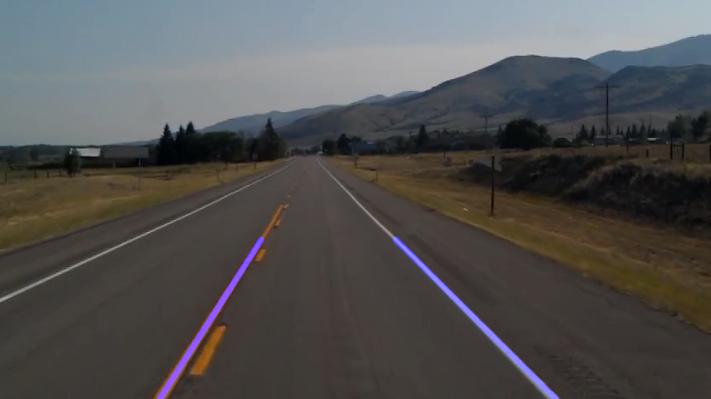

# Simple road lanes detector

As always, importing important stuff


```python
import cv2 as cv
import numpy as np
import matplotlib.pyplot as plt
```

We will detect lines with Canny algorithm, so let's define function with required preprocessing


```python
def canny(image):
    grey = cv.cvtColor(image, cv.COLOR_RGB2GRAY)
    blur = cv.GaussianBlur(grey, (5, 5), 0)
    canny = cv.Canny(blur, 50, 150)
    return canny
```

We have well defined ROI - triangle of road in the middle of frame. All other image part is noise for this task


```python
def region_of_interest(image):
    height = image.shape[0]
    triangle = np.array([[(200, height), (1100, height), (550, 250)]])
    mask = np.zeros_like(image)
    cv.fillPoly(mask, triangle, 255)
    masked_image = cv.bitwise_and(image, mask)
    return masked_image
```

Helper function for averaging detected lines in one line


```python
def average_slope_intercept(image, lines):
    left_fit = []
    right_fit = []
    if not lines is None:
        for line in lines:
            x1, y1, x2, y2 = line.reshape(4)
            parameters = np.polyfit((x1, x2), (y1, y2), 1)
            slope = parameters[0]
            intercept = parameters[1]
            if slope < 0:
                left_fit.append((slope, intercept))
            else:
                right_fit.append((slope, intercept))
        left_fit_average = np.average(left_fit, axis=0)
        right_fit_average = np.average(right_fit, axis=0)
        left_line = make_coordinates(image, left_fit_average)
        right_line = make_coordinates(image, right_fit_average)
    return np.array([left_line, right_line])
```

And some more helpers for displaying and positioning stuff


```python
def display_lines(image, lines):
    line_image = np.zeros_like(image)
    if lines is not None:
        for x1, y1, x2, y2 in lines:
            cv.line(line_image, (x1, y1), (x2,y2), (255,0,0), 10)
    return line_image

def make_coordinates(image, line_parameters):
    slope, intercept = line_parameters
    # make our averaged lines from bottom of image...
    y1 = image.shape[0]
    # ...to 3/5 of image vertically
    y2 = int(y1*(3/5))
    # and find corresponding x-es
    # consider y = a*x+b, x = (y-b)/a
    x1 = int((y1-intercept)/slope)
    x2 = int((y2-intercept)/slope)
    return np.array([x1, y1, x2, y2])

```

Apply all this to video stream


```python
cap = cv.VideoCapture("test2.mp4")
while(cap.isOpened):
    ret, frame = cap.read()
    canny_image = canny(frame)
    cropped_image = region_of_interest(canny_image)
    lines = cv.HoughLinesP(cropped_image, 2, np.pi/180, 100,
                        np.array([]), minLineLength=40, maxLineGap=5)
    averaged_lines = average_slope_intercept(frame, lines)
    line_image = display_lines(frame, averaged_lines)
    combo_image = cv.addWeighted(frame, 0.8, line_image, 1, 1)

    cv.imshow("canny", combo_image)
    if cv.waitKey(1) & 0xFF == ord('q'):
        break
cap.release()
cv.destroyAllWindows()
```
